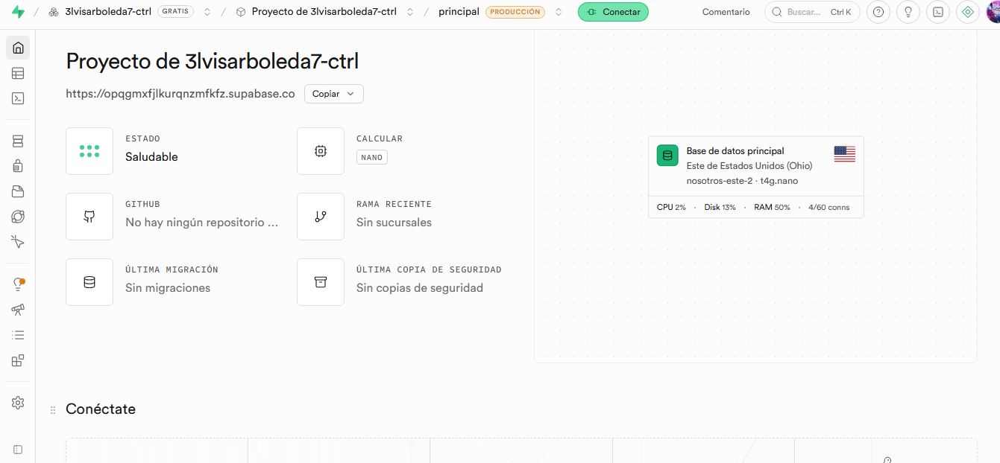
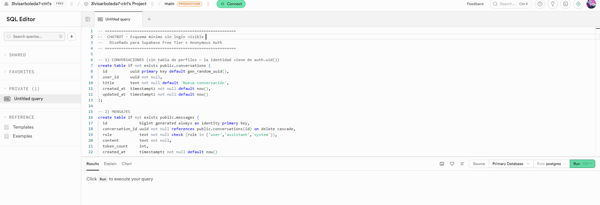
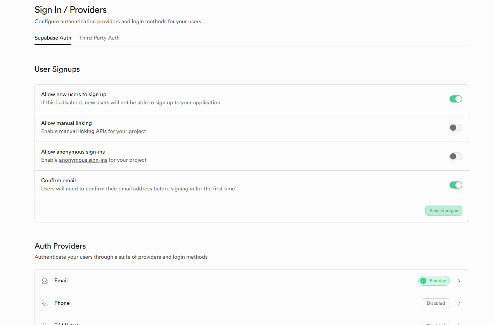
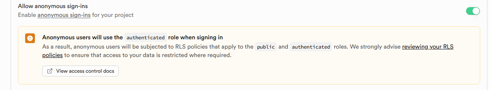
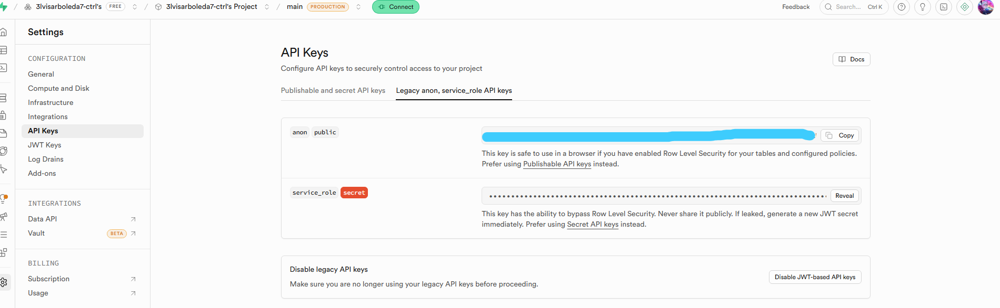
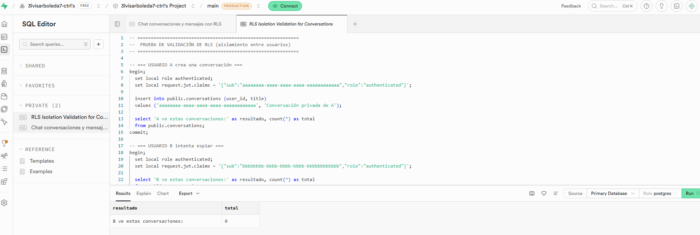
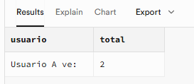
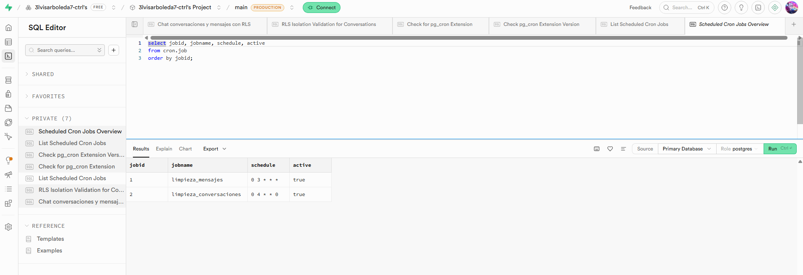

# Persona 3 — Persistencia y Autenticación con Supabase
### Bot a Costo Cero · Documento de Investigación y Avance
**Responsable:** Persona 3
**Proyecto:** Chatbot gratuito (Frontend + Backend Groq + Supabase + Cloud Run)
**Fecha:** 2026-06-06
**Regla del proyecto:** si una pieza necesita plan pago para funcionar de forma básica, queda descartada o pasa a Plan B.

> **Cómo leer este documento:** sigue la estructura pedida por el equipo (Descripción → Casos de Uso → Pricing/Límites → Alternativas) y al final incluye los **3 entregables específicos de Persona 3**: esquema SQL mínimo, política de limpieza de mensajes y lista de funciones de Supabase usables gratis.

---

## 0. Resumen ejecutivo (para el profesor y CCAT)

> **Contexto:** el chatbot es para el **CEE — Centro de Especialización Ejecutiva (UNI-FIIS)**, que ofrece cursos y programas de especialización. El **CCAT** se encarga de la **página web** donde se aloja el bot.

- **Supabase SÍ es viable a costo cero** para nuestro MVP: nos da en un solo servicio **base de datos PostgreSQL + Autenticación + Seguridad por filas (RLS) + API automática**, todo dentro del plan gratuito.
- El plan Free cubre de sobra nuestro volumen esperado: **500 MB de base de datos**, **5 GB de egress**, **1 GB de storage**, **50,000 usuarios activos/mes** y **2 proyectos activos**.
- **Los 2 riesgos reales del Free** son: (1) el proyecto **se pausa tras 1 semana de inactividad** y (2) **no hay backups automáticos**. Ambos tienen mitigación gratuita (ver §3 y §7).
- Para nuestro caso (chatbot) **NO necesitamos Storage ni Realtime de forma obligatoria**; con **DB + Auth + RLS** es suficiente. Esto deja casi todo el cupo libre.

---

## 1. Descripción de la Herramienta

### 1.1 ¿Qué es Supabase?
Supabase es una plataforma "Backend as a Service" (BaaS) de código abierto, presentada como **alternativa libre a Firebase**. Su núcleo es una **base de datos PostgreSQL real** (no un sistema propietario), y encima ofrece:

- **Database**: PostgreSQL completo (SQL estándar, relaciones, índices, funciones, triggers, extensiones).
- **Auth**: sistema de inicio de sesión listo (email/contraseña, magic link, OTP, OAuth con Google/GitHub, etc.).
- **Auto-generated API**: cada tabla expone automáticamente una API REST (y GraphQL) sin escribir backend.
- **Row Level Security (RLS)**: reglas de seguridad a nivel de fila para que **cada usuario solo vea sus propios datos**.
- **Storage / Realtime / Edge Functions**: archivos, suscripciones en vivo y funciones serverless (opcionales para nosotros).

> **Por qué encaja en "costo cero":** en lugar de montar y pagar un servidor de base de datos + un sistema de login por separado, Supabase nos da ambos gratis y administrados.

### 1.2 Cómo usarlo con 0 conocimiento (paso a paso)

> 📸 **Capturas que debes tomar para el documento final** (el profesor pidió imágenes reales del proveedor). Toma screenshot en cada paso marcado con 📸.

1. **Crear cuenta** → entrar a `https://supabase.com` → botón **"Start your project"** → registrarse con GitHub o email.
2. **Crear proyecto** → botón **"New project"** → elegir nombre, **contraseña de la base de datos** (guardarla) y **región** (elegir la más cercana, ej. `South America (São Paulo)` para baja latencia).
3. **Esperar el aprovisionamiento** (~2 min). Supabase crea automáticamente una base PostgreSQL + endpoints. El dashboard muestra el estado **"Saludable"**:



4. **SQL Editor** (menú izquierdo) → pegar el script del esquema (ver §6) → clic en **Run**. Las tablas se crean automáticamente ("Success. No rows returned"):



5. **Authentication → Providers** (menú izquierdo) → desplazarse a **"Allow anonymous sign-ins"** → habilitar toggle. **Esto es lo único de Auth que necesitamos** — el frontend genera sesiones anónimas sin que el usuario lo sepa.





6. **Project Settings → API** → copiar la **`Project URL`** y la **`anon public key`**. Estas dos credenciales son las que usan el Frontend (Persona 1) y el Backend (Persona 2) para conectarse.



> **Conclusión de usabilidad:** una persona sin experiencia puede tener una base de datos **sin login visible** y lista para usar en **menos de 10 minutos**. El usuario simplemente llega a la web, el frontend crea una sesión anónima automáticamente, y todo funciona sin registro ni contraseña.

### 1.3 Cómo se conecta con el resto del equipo

```
[ Persona 1: Frontend ]  →  usa supabase-js para LOGIN y para leer/guardar mensajes
          │
          ▼
[ Persona 2: Backend FastAPI/Express + Groq ]  →  valida el token de Supabase y
          │                                         guarda la conversación en la DB
          ▼
[ Persona 3: SUPABASE ]  →  PostgreSQL (conversations, messages) + Auth + RLS
          ▲
          │
[ Persona 4: Cloud Run ]  →  guarda la SUPABASE_URL y SERVICE_KEY como variables/secretos
```

---

## 2. Casos de Uso (en nuestro chatbot)

| # | Caso de uso | Función de Supabase | ¿Gratis? |
|---|-------------|---------------------|----------|
| 1 | **Sin login visible:** generar sesión anónima automática | **Auth → Anonymous Sign-ins** | ✅ |
| 2 | Que cada usuario vea solo SUS conversaciones (sin registrarse) | **RLS (Row Level Security) + auth.uid()** | ✅ |
| 3 | Guardar el historial de chat (conversaciones y mensajes) | **Database (PostgreSQL)** | ✅ |
| 4 | Leer historial al reabrir la app | **Database + API REST autogenerada** | ✅ |
| 5 | Borrado automático de mensajes viejos (ahorro de espacio) | **pg_cron / Database functions** | ✅ |
| 6 | (Opcional) Login con Google para usuarios registrados | **Auth → OAuth providers** | ✅ |
| 7 | (Opcional) Sincronizar mensajes en vivo entre pestañas | **Realtime** | ✅ (no necesario para MVP) |
| 8 | (Opcional) Guardar archivos adjuntos / avatar | **Storage** | ✅ (no necesario para MVP) |

> **Decisión de diseño:** para el MVP usamos **Database + Anonymous Auth + RLS**. El usuario no ve ni toca login — simplemente llega a la web y el frontend genera una sesión anónima automática. Supabase asigna un UUID único (`auth.uid()`) que RLS usa para aislar datos. Realtime y Storage quedan como "extras" sin activar. Así maximizamos accesibilidad y margen del free tier.

---

## 2.5 Flujo arquitectónico: "Un solo clic" sin login visible

### Cómo funciona Anonymous Auth (para entender la mágica)

```
Usuario hace clic en la web del bot (web del CEE, gestionada por CCAT)
        ↓
Frontend (Persona 1) se carga en el navegador
        ↓
JavaScript ejecuta: supabase.auth.signInAnonymously()
        ↓
Supabase genera automáticamente:
  - Un UUID único (ej: a1b2c3d4-e5f6-7890-abcd-ef1234567890)
  - Una sesión temporal (token JWT)
  - Guarda: user_id = a1b2c3d4-e5f6-7890-abcd-ef1234567890
        ↓
Frontend guarda ese user_id en localStorage (o sessionStorage)
        ↓
Al crear una conversación: INSERT INTO conversations (user_id) VALUES ('a1b2c3d4...')
        ↓
RLS valida: ¿auth.uid() = a1b2c3d4...? SÍ → permite
        ↓
Usuario B llega con su UUID diferente (ej: x9y8z7w6...)
        ↓
Si intenta leer conversaciones de A:
  RLS valida: ¿auth.uid() = a1b2c3d4...? NO → bloquea
        ↓
✅ Datos aislados sin que nadie se registre
```

### Ventajas de Anonymous Auth para el MVP

| Aspecto | Beneficio |
|--------|-----------|
| **User Experience** | Cero fricción: entra → empieza a chatear |
| **Seguridad** | RLS mantiene datos aislados automáticamente |
| **Costo** | Gratis en el plan Free de Supabase |
| **Privacidad** | No pides email ni datos personales |
| **MAU (Monthly Active Users)** | Cuenta como 1 MAU por usuario, sin importar cuántas veces entre |

### Limitación: sesiones temporales

- Una sesión anónima **expira** si el usuario cierra navegador/tab
- Solución: guardar `user_id` en localStorage → al reabrir, se reconoce por UUID (no se genera uno nuevo)
- Alternatively: Persona 1 puede permitir que el usuario se "registre" después si quiere historial persistente

---

## 3. Pricing y Límites de la Herramienta

### 3.1 Tabla oficial del plan Free (verificada en supabase.com/pricing, 2026)

| Recurso | Plan Free (incluido) | ¿Nos alcanza? |
|---|---|---|
| Proyectos activos | **2** | ✅ (1 prod + 1 pruebas) |
| Tamaño de base de datos | **500 MB** (CPU compartida, 500 MB RAM) | ✅ con limpieza |
| Egress (salida de datos) | **5 GB** + 5 GB cacheado | ✅ con UI liviana |
| File Storage | **1 GB** | ✅ (no lo usamos en MVP) |
| Tamaño máximo por archivo | **50 MB** | ✅ |
| Usuarios activos / mes (MAU) | **50,000** | ✅ (sobra muchísimo) |
| Realtime: conexiones concurrentes | **200** | ✅ |
| Realtime: mensajes / mes | **2,000,000** | ✅ |
| Edge Functions: invocaciones / mes | **500,000** | ✅ |
| **Pausa por inactividad** | **A la 1 semana sin uso** ⚠️ | Requiere mitigación |
| **Backups automáticos** | **❌ NO incluidos en Free** ⚠️ | Requiere mitigación |
| Compute dedicado | ❌ (recursos compartidos) | OK para MVP |
| Retención de logs | 1 día | OK para MVP |

> **MAU (Monthly Active User):** usuario único que se autentica al menos una vez en una ventana de 30 días. Un usuario que entra varias veces cuenta **una sola vez**. Por eso 50,000 es enorme para un proyecto académico.

### 3.2 Cálculo de uso estimado (para justificar que cabemos en Free)

**Supuesto MVP:** 50 usuarios de prueba, ~30 mensajes por usuario al mes.

- **Filas de mensajes:** 50 × 30 = **1,500 mensajes/mes**.
- **Tamaño por fila** (id, conversation_id, role, content ~500 bytes, timestamps + índices) ≈ **~1 KB**.
- **Crecimiento de DB:** ~1,500 KB ≈ **1.5 MB/mes** → tardaríamos **años** en acercarnos a 500 MB.
- **Egress:** lo que más gasta es **enviar historial al navegador**. Si limitamos a leer solo los últimos N mensajes (ver §7), el egress mensual es de **pocos MB**, muy lejos de los 5 GB.

> **Conclusión:** con limpieza básica y una UI liviana, el cuello de botella **no es el almacenamiento ni el egress**, sino los 2 riesgos operativos (pausa y backups), que se mitigan gratis.

### 3.3 Planes pagos (solo como referencia — quedan fuera por la regla del proyecto)

- **Pro: $25/mes** → 8 GB DB, 100,000 MAU, 250 GB egress, 100 GB storage, **backups diarios**, sin pausa, $10 en créditos de compute.
- **Team: $599/mes** y **Enterprise: a medida**.

> Para nuestro proyecto **se queda en Free**. El Pro solo sería relevante si el proyecto pasara a producción real 24/7.

---

## 4. Alternativas (Plan B gratuito si Supabase no conviene)

El mayor "pero" de Supabase Free es la **pausa tras 1 semana de inactividad**. Si eso fuera un problema (ej. el profesor revisa esporádicamente), estos son los reemplazos gratuitos:

| Alternativa | Qué ofrece gratis | Ventaja vs Supabase | Desventaja |
|---|---|---|---|
| **Neon** (Postgres serverless) | ~0.5 GB, escala a cero y **reanuda al instante** | No "se pausa" de forma molesta; es Postgres puro | **No trae Auth** (habría que sumar otro servicio) |
| **Firebase (Spark)** | Firestore + **Auth incluido** + Hosting | Auth muy maduro, no se pausa | Base **NoSQL** (no SQL/RLS), rehacer el modelo |
| **Appwrite Cloud** | DB + Auth + Storage + Functions | Open-source, todo-en-uno como Supabase | Free tier más limitado, menos maduro |
| **Turso** (libSQL/SQLite) | Free tier amplio en filas/lecturas | Muy generoso en lecturas | No trae Auth; SQLite, no Postgres |
| **PocketBase** (self-host) | DB SQLite + Auth en 1 binario | Gratis 100%, control total | Hay que **hostearlo** (Fly.io/Oracle Cloud free) |

**Combo Plan B recomendado:** **Neon (base de datos) + Clerk o Firebase Auth (login)**.
- *Pro:* Neon no sufre la pausa molesta de Supabase.
- *Contra:* perdemos la integración nativa DB↔Auth↔RLS que Supabase da "de fábrica", y hay que coordinar 2 servicios.

> **Recomendación de Persona 3:** **mantener Supabase como opción principal** (mejor relación funciones/esfuerzo a costo cero) y dejar **Neon + Firebase Auth como Plan B documentado**.

---

# ENTREGABLES ESPECÍFICOS DE PERSONA 3

## 5. (Entregable) Lista de funciones de Supabase usables GRATIS

### ✅ Sí se pueden usar en Free (incluyendo nuestro MVP)

**Para nuestro MVP específicamente:**
- **Anonymous Sign-ins**: genera sesiones automáticas sin login visible. ✅ **USAMOS ESTO**.
- **Row Level Security (RLS)**: políticas por fila ligadas a `auth.uid()` (funciona igual con usuarios anónimos). ✅ **USAMOS ESTO**.
- **PostgreSQL completo**: tablas, relaciones, índices, vistas, triggers.
- **API REST autogenerada** (PostgREST): cada tabla expone automáticamente operaciones CRUD.
- **pg_cron extension**: tareas programadas para limpieza de mensajes viejos.

**Disponible pero NO usamos en MVP:**
- Email/contraseña, Magic Link, OTP, OAuth social (para futuro si queremos login opcional).
- Realtime: 200 conexiones / 2M mensajes (opcional).
- Storage: 1 GB (opcional).
- Edge Functions: 500k invocaciones/mes.
- GraphQL autogenerado.
- Database Webhooks y Functions (RPC).
- Librerías cliente (`supabase-js`, Python, etc.).

### ⚠️ Limitado o NO disponible en Free (tener en cuenta)
- ❌ **Backups automáticos** (solo Pro+). → Mitigación: exportar SQL/CSV manualmente o un dump por `pg_dump` programado.
- ⚠️ **Pausa tras 1 semana** de inactividad. → Mitigación: keep-alive (ver §7).
- ⚠️ Solo **2 proyectos activos** y **compute compartido**.
- ❌ Sin PITR (point-in-time recovery), sin custom domain, retención de logs de 1 día.

---

## 6. (Entregable) Esquema SQL Mínimo

Diseñado para **caber en el free tier** (poco espacio, índices justos) y con **RLS** para que cada usuario (anónimo o no) solo acceda a lo suyo. Funciona con **Anonymous Auth** — no hay tabla de perfiles ni registro. Pegar en **SQL Editor** de Supabase.

```sql
-- =========================================================
--  CHATBOT · Esquema mínimo sin login visible (Persona 3)
--  Diseñado para Supabase Free Tier + Anonymous Auth
-- =========================================================

-- 1) CONVERSACIONES (sin tabla de perfiles — la identidad viene de auth.uid())
create table if not exists public.conversations (
  id          uuid primary key default gen_random_uuid(),
  user_id     uuid not null,  -- Supabase asigna automáticamente via auth.uid()
  title       text not null default 'Nueva conversación',
  created_at  timestamptz not null default now(),
  updated_at  timestamptz not null default now()
);

-- 2) MENSAJES
create table if not exists public.messages (
  id              bigint generated always as identity primary key,
  conversation_id uuid not null references public.conversations(id) on delete cascade,
  role            text not null check (role in ('user','assistant','system')),
  content         text not null,
  token_count     int,                       -- opcional, ayuda a Persona 2 a controlar tokens
  created_at      timestamptz not null default now()
);

-- ÍNDICES (solo los necesarios -> menos espacio y consultas rápidas)
create index if not exists idx_conversations_user
  on public.conversations(user_id, updated_at desc);
create index if not exists idx_messages_conversation
  on public.messages(conversation_id, created_at);

-- =========================================================
--  ROW LEVEL SECURITY (cada usuario anónimo/autenticado ve lo suyo)
-- =========================================================
alter table public.conversations enable row level security;
alter table public.messages      enable row level security;

-- CONVERSATIONS: solo tu usuario puede ver/editar sus conversaciones
create policy "conversaciones propias" on public.conversations
  for all using (auth.uid() = user_id) with check (auth.uid() = user_id);

-- MESSAGES: solo si la conversación es tuya, puedes ver/editar sus mensajes
create policy "mensajes de mis conversaciones" on public.messages
  for all using (
    exists (
      select 1 from public.conversations c
      where c.id = messages.conversation_id
        and c.user_id = auth.uid()
    )
  )
  with check (
    exists (
      select 1 from public.conversations c
      where c.id = messages.conversation_id
        and c.user_id = auth.uid()
    )
  );

-- Trigger: actualizar updated_at de la conversación al insertar mensaje
create or replace function public.touch_conversation()
returns trigger language plpgsql as $$
begin
  update public.conversations
     set updated_at = now()
   where id = new.conversation_id;
  return new;
end; $$;

create trigger trg_touch_conversation
  after insert on public.messages
  for each row execute function public.touch_conversation();
```

**Notas de diseño orientadas al free tier + Anonymous Auth:**
- **Sin tabla `profiles`**: la identidad del usuario es simplemente `auth.uid()` (UUID anónimo generado por Supabase).
- `messages.id` es `bigint identity` (8 bytes) en vez de UUID → ahorra espacio en la tabla que más crece.
- Solo **2 índices** (los imprescindibles) → menos consumo de los 500 MB.
- `on delete cascade` → al borrar una conversación se borran sus mensajes (limpieza automática y sin huérfanos).
- **RLS funciona igual con Anonymous Auth** porque está basada en `auth.uid()`, que Supabase asigna automáticamente a usuarios anónimos.

---

## 6.5 (Cómo hacerlo) Habilitar Anonymous Auth en Supabase

En tu proyecto Supabase ya creado, sigue estos pasos:

### Paso 1: Ir a Authentication → Providers

1. En el menú izquierdo, clic en **Authentication** (ícono de llave 🔐)
2. Clic en **Providers**
3. Desplázate hasta **"Anonymous Sign-ins"** (debería estar en la lista)

### Paso 2: Habilitar Anonymous Sign-ins

- Clic en el toggle/interruptor para **habilitarlo**
- Verás que pasa a verde/activado
- **Haz una screenshot aquí** para tu documento

### Paso 3: Configuración opcional (dejar como default)

- Supabase muestra opciones como "Allow signup" (déjalo como está)
- La configuración default funciona perfectamente para nosotros

### Paso 4: Guardar

- Clic en **Save** (si aparece botón)
- Listo — Anonymous Auth está habilitado

---

### Verificación: ¿Cómo sé que funciona?

En la sección **Providers**, debería ver:

```
Anonymous Sign-ins:  [✅ ENABLED]
```

Si ves esto, Anonymous Auth está listo. El frontend (Persona 1) puede ahora usar:

```javascript
// Código que Persona 1 usará en el frontend:
const { data, error } = await supabase.auth.signInAnonymously();
// Supabase automáticamente asigna: auth.uid() = UUID único
```

---

## 6.6 (Prueba realizada) Validación de RLS — aislamiento entre usuarios

Para demostrar que **un usuario NO puede ver los datos de otro**, se simularon dos usuarios anónimos en el SQL Editor (usando `set local request.jwt.claims` para imitar dos `auth.uid()` distintos):

- **Usuario A (dueño):** ve **sus propias** conversaciones. ✅
- **Usuario B (intruso):** ve **0** conversaciones de A → bloqueado por RLS. 🔒





> **Conclusión:** el aislamiento de datos funciona incluso con usuarios anónimos, porque las políticas RLS se basan en `auth.uid()`, que Supabase asigna automáticamente a cada sesión anónima.

---

## 7. (Entregable) Política de Limpieza de Mensajes

Objetivo: **nunca acercarnos a los 500 MB de DB ni a los 5 GB de egress**, y **evitar la pausa del proyecto**.

### 7.1 Reglas de retención (en la base de datos)
1. **Borrar mensajes con más de 30 días** (historial corto para un MVP).
2. **Borrar conversaciones inactivas** (sin mensajes nuevos en 30 días) → cascada borra sus mensajes.
3. (Opcional) **Tope de N mensajes por conversación**: conservar solo los últimos 50.

### 7.2 Implementación gratis con `pg_cron`
```sql
-- Activar extensión (disponible en Free)
create extension if not exists pg_cron;

-- Limpieza diaria 03:00: borra mensajes con más de 30 días
select cron.schedule(
  'limpieza_mensajes',
  '0 3 * * *',
  $$ delete from public.messages where created_at < now() - interval '30 days'; $$
);

-- Limpieza semanal: borra conversaciones sin actividad en 30 días (cascade)
select cron.schedule(
  'limpieza_conversaciones',
  '0 4 * * 0',
  $$ delete from public.conversations where updated_at < now() - interval '30 days'; $$
);
```

**Verificación:** ambos jobs quedan registrados y activos (`active = true`) en la tabla `cron.job`:



### 7.3 Ahorro de egress (coordinar con Persona 1 y 2)
- **No traer todo el historial**: el Frontend pide solo los **últimos 20–50 mensajes** por conversación (`order by created_at desc limit 50`).
- **Paginación** ("cargar más") en vez de descargar todo de golpe.
- **El Backend (Persona 2) envía a Groq solo los últimos N mensajes**, no toda la conversación → ahorra tokens Y reduce lecturas.

### 7.4 Evitar la pausa por inactividad (keep-alive gratis)
La pausa ocurre tras **1 semana sin actividad**. Mitigación de costo cero:
- Un **cron externo gratuito** (GitHub Actions, `cron-job.org` o UptimeRobot) que haga **una petición ligera cada 2–3 días** a la API de Supabase (ej. `select 1` vía un endpoint o un health-check del backend).
- Esto mantiene el proyecto "activo" sin consumir cupo relevante.

### 7.5 Respaldo manual (porque Free no tiene backups)
- Exportar periódicamente con **`pg_dump`** o desde el Dashboard (Table Editor → export CSV) antes de entregas importantes.
- Guardar el script `schema.sql` (§6) en el repositorio → permite recrear todo en minutos.

---

## 8. Conclusiones y recomendación final de Persona 3

1. **Supabase Free cubre nuestras necesidades** (DB + Auth + RLS + API) **sin pagar nada**.
2. El **almacenamiento y el egress no son un riesgo** con limpieza básica y UI liviana (estimado: ~1.5 MB/mes de crecimiento).
3. Los **2 riesgos reales** (pausa por inactividad y falta de backups) **tienen mitigación gratuita** (keep-alive externo + dump manual).
4. **MVP usa solo DB + Auth + RLS**; Realtime y Storage quedan disponibles pero sin activar para no consumir cupo.
5. **Plan B documentado:** Neon + Firebase Auth, por si la pausa de Supabase se vuelve un problema.

---

### Fuentes (oficiales y verificadas)
- [Pricing & Fees — Supabase](https://supabase.com/pricing)
- [Supabase Auth — Docs](https://supabase.com/docs/guides/auth)
- [Billing on Supabase — Docs](https://supabase.com/docs/guides/platform/billing-on-supabase)
- [Storage Pricing — Docs](https://supabase.com/docs/guides/storage/pricing)

> **Capturas incluidas:** este documento contiene imágenes reales tomadas desde la cuenta de Supabase del proyecto (`img/`), tal como pidió el profesor — dashboard, esquema SQL ejecutado, Anonymous Auth habilitado, API keys, validación de RLS y jobs de limpieza pg_cron.
